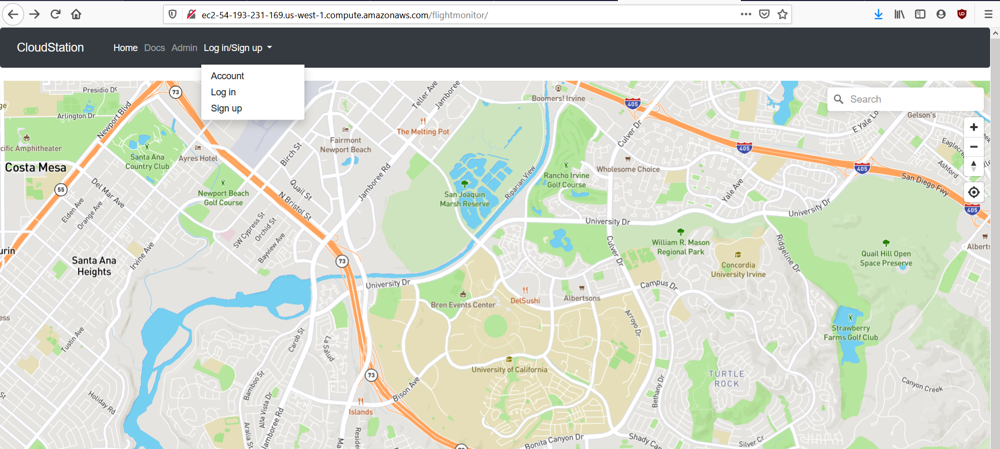
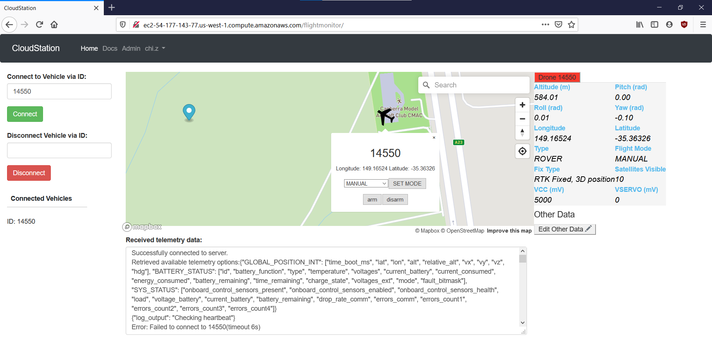
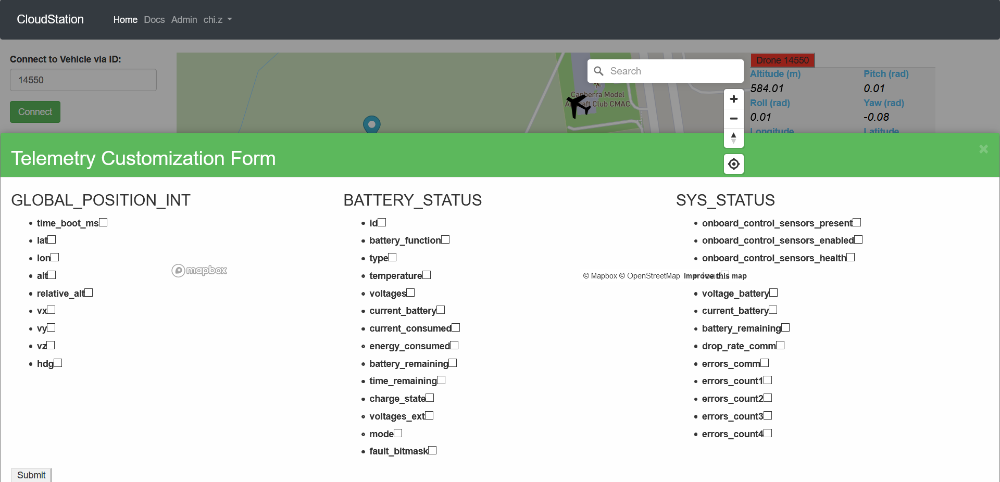

# How to Use 
For a video guide on how to use CloudStation, go [here](https://youtu.be/PB6MMZeGsj8). \
Another [Doc](./waypoints.md) and video guide about waypoints.

 
1. In your web browser, go to your AWS instance's DNS address. You will see a map that takes up the whole screen. In the menu at the top, click "Log in/Sign up" and select "Sign up."
2. Sign up for an account, using a password that you are not using for any other accounts.
3. After logging in with your new account, you will see a box that says "Connect to Vehicle via ID."
    * Make sure your drone or SITL instance is connected to one of your CloudStation instance's open UDP ports.
    * Enter the number of the UDP port your drone is connected to (e.g. 14550). This will be that vehicle's drone ID.
 
4. Controlling the drone:
    * Please note that only rovers are currently supported by CloudStation. You will not be able to control any flying vehicle type. CloudStation has also only been tested on drones running ArduPilot firmware.
    * You can arm/disarm the drone or change its flight mode by clicking on the drone's icon on the map.
    * To set a fly-to point, make sure the tab of the drone you want to control is selected on the right-hand menu. Left-click anywhere on the map to drop a pin, then right click the pin to bring up the pop-up menu. From here, you can either "clear pin" or have the drone "fly-to" the pin.
 
5. Adjusting displayed telemetry data:
    * On any connected drone, click the "Edit Data" button under the default telemetry table. This will bring up a form with several columns of checkboxes.
    * Select the data fields you would like to monitor and click "Submit." Data for the fields you selected will now be displayed in the "Other Data" section of the telemetry monitor. This change will apply for all drones.
