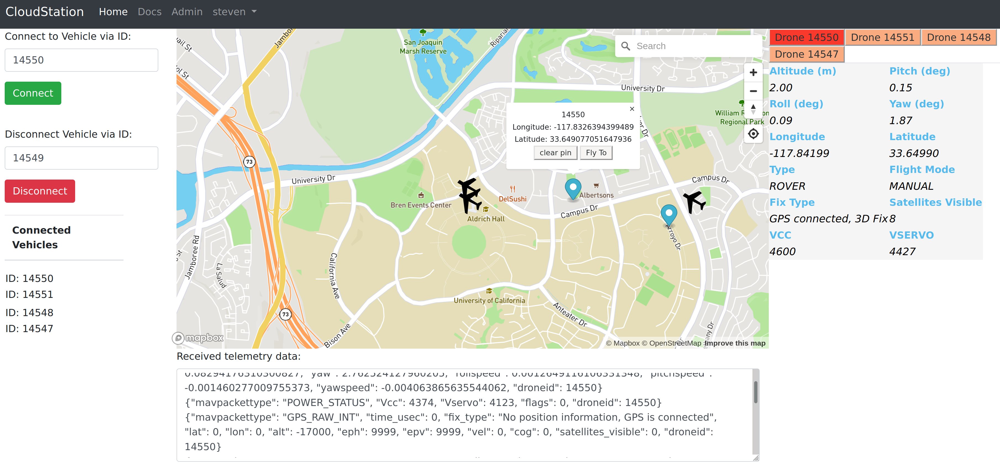

.. CloudStation documentation master file, created by
   sphinx-quickstart on Sun Jan  5 17:30:33 2020.
   You can adapt this file completely to your liking, but it should at least
   contain the root `toctree` directive.

CloudStation: A Web-based Ground Control Station
================================================
The goal of this project is to develop a cloud-based ground control station for Ardupilot drones. The web app is designed to be easily scalable so users can control multiple drones at the same time. The project is still under development and we would love to have more developers joining us!

Website: `CloudStation
<http://ec2-52-52-195-170.us-west-1.compute.amazonaws.com/>`_.

.. toctree::
   :maxdepth: 2
   :caption: Contents:
   :glob:

   webapp
   deployment
   howtouse
   contributing
   contributors
   license