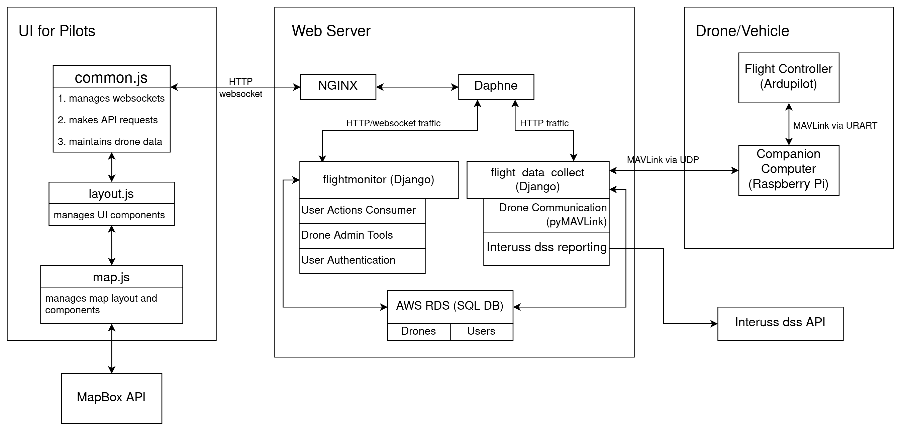

# Overview
 [GitHub](https://github.com/CloudStationTeam)
## System architecture
  
 

## Links
[[J78] Lyuyang Hu ; Omkar Pathak ; Zeyu He ; Hunkyu Lee ; Mina Bedwany ; Jace Mica ; Peter J. Burke “CloudStation”: A Cloud-based Ground Control Station for Drones ” IEEE Journal on Miniaturization for Air and Space Systems (2020)](http://www.burkelab.com/wp-content/uploads/%E2%80%9CCloudStation%E2%80%9D-A-Cloud-based-Ground-Control-Station-for-Drones.pdf)

[CloudStation - UCI MCS/MSWE Capstone Presentation '20](https://youtu.be/aJPaCRSWjKY)

## Milestones & Backlogs
[x] System architecture and prototype (8/31/19)

[x] Rewrite mavlink streaming code (9/5/19) 

[x] Add map to html (10/15/19)  

[x] Deploy on AWS (10/15/19) We are online!!!  

[x] Build hardware stack with Omnibus F4 and Raspberry Pi (10/30/19)  

[x] Two way communication between vehicle and the server (11/5/19) 

[x] User authentication (11/16/19)  

[x] Mark drone location on map (11/24/19)  

[x] Migrate to AWS RDS (2/25/20) 

[x] Communicate with multiple drones at the same time (1/23/20)  

[ ] Distinguish different users. Only send vehicle updates to authorized users  

[x] Develop an improved UI for telemetry data   

[x] Use a more robust background tasks solution (we don't use `django_background_tasks` any more!)

[x] Get automated SITL drone swarms running with CloudStation

[x] Add customizable telemetry options

[] Link customizable telemetry options to specific users

[x] Waypoints (Cloudstation V 3.0 (Fall 2023)). This was a student project that crashed the drone. So it is on the back burner for now

[x] Cloudstation 4.0 (Released January 2024). Add support for all flight modes, arm/disarm clearly on UI, support land/takeoff, RTL.

